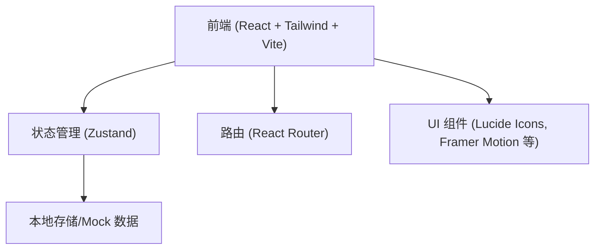
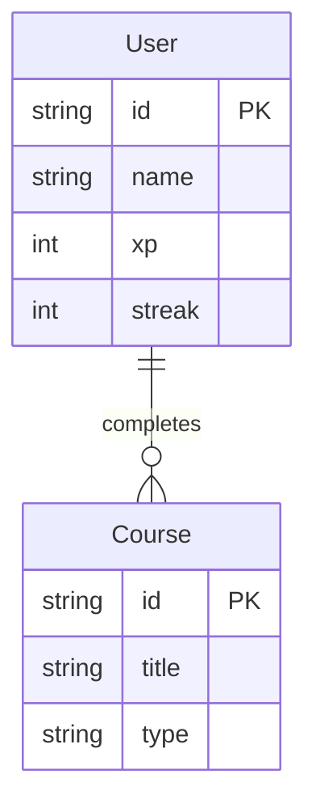

## 1. 架构设计


## 2. 技术说明
- 前端：React@18 + tailwindcss@3 + vite
- 初始化工具：vite-init (基于 pnpm)
- 状态管理：Zustand
- 路由：React Router DOM
- 样式：Tailwind CSS + CSS Variables (支持深色/浅色主题及强调色定制)
- 图标：lucide-react
- 动画：framer-motion (用于翻页、卡片翻转、正确/错误反馈)

## 3. 路由定义
| 路由 | 用途 |
|-------|---------|
| / | 首页，展示学习概览和推荐路径 (Dashboard) |
| /login | 用户登录/注册页 |
| /courses | 分级课程体系列表页 (路线图) |
| /learn/:lessonId | 互动式学习模块（沉浸式全屏练习界面） |
| /profile | 学习进度追踪与成就展示页 |
| /community | 社区交流与排行榜页 |

## 4. API 定义 (如果存在后端)
本应用目前为纯前端实现，数据层通过 Zustand 和 LocalStorage 进行模拟。
```typescript
interface UserProfile {
  id: string;
  name: string;
  avatar: string;
  level: string;
  streak: number;
  xp: number;
}

interface CourseNode {
  id: string;
  title: string;
  status: 'locked' | 'unlocked' | 'completed';
  type: 'vocabulary' | 'grammar' | 'speaking' | 'listening';
  stars: number;
}
```

## 5. 数据模型
### 5.1 数据模型定义

