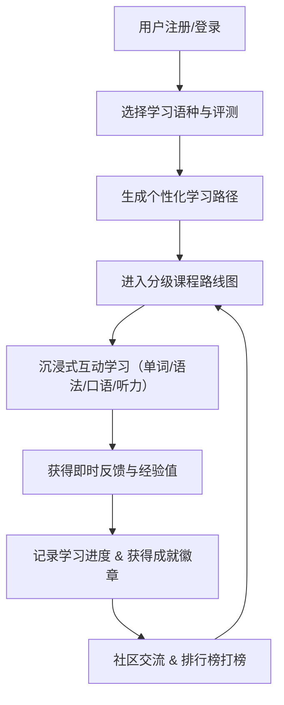

## 1. 产品概述
开发一款支持多语种（或 Python 等编程语言，此处以广义多语言学习平台设计）学习的在线教育平台，旨在为用户提供沉浸式的语言学习体验。
- 主要解决用户在语言学习中缺乏互动、难以坚持的问题，目标用户为语言学习爱好者及备考人员。
- 产品价值在于通过游戏化、分级化、个性化的学习路径，以及社区互动，提升用户的学习效率和留存率。

## 2. 核心功能

### 2.1 用户角色
| 角色 | 注册方式 | 核心权限 |
|------|---------------------|------------------|
| 普通学习者 | 邮箱/账号注册 | 访问课程、进行互动练习、参与社区交流、查看学习进度及成就 |

### 2.2 功能模块
1. **首页概览**: 欢迎区、当前学习语种概况、个性化学习路径推荐、核心数据（连续学习天数、经验值）。
2. **分级课程页**: 树状/地图式分级课程体系，包含单元和关卡（A1-C2或初中高级）。
3. **沉浸式互动学习页**: 单词记忆（翻转卡片）、语法练习（选择填空）、口语跟读（模拟录音波形）、听力训练（音频播放控制）。
4. **进度与成就页**: 学习进度追踪图表、雷达图能力分析、成就徽章展示系统。
5. **社区交流页**: 学习动态广场、经验分享发帖、排行榜（按周/月经验值打榜）。

### 2.3 页面详情
| 页面名称 | 模块名称 | 功能描述 |
|-----------|-------------|---------------------|
| 首页 (Dashboard) | 个性化推荐与概览 | 展示用户当前学习进度，推荐下一步学习任务，快速进入学习 |
| 课程路线图 | 分级课程列表 | 游戏化关卡地图布局，展示已解锁和未解锁课程单元 |
| 互动学习页 | 听说读写练习 | 沉浸式全屏互动练习，提供即时正确/错误动画反馈和答案解析 |
| 进度成就页 | 学习追踪与徽章 | 数据可视化展示学习时长、掌握词汇量，陈列已获成就徽章 |
| 社区互动页 | 交流与排行榜 | 用户发帖互动，展示积分排行榜，激发学习动力 |

## 3. 核心流程
用户核心学习流程如下：

## 4. 用户界面设计
### 4.1 设计风格
- **主次色调**：以充满活力的紫罗兰色（Violet/Purple）为主色调，搭配薄荷绿（Mint）、珊瑚粉（Coral）及明黄色（Yellow）作为辅色和状态色，营造轻松、愉悦的游戏化学习氛围。
- **按钮风格**：圆润、带有微立体感（Soft 3D / Neumorphism 结合现代扁平化），点击有明显的反馈动效和阴影变化。
- **字体与大小**：使用圆润亲和的无衬线字体（如 Nunito 或 Quicksand 风格），标题清晰醒目，正文易于阅读，层级分明（text-3xl 到 text-sm）。
- **布局风格**：卡片式布局（Card-based），大量留白（Negative space），大圆角（rounded-2xl/3xl），桌面端采用侧边栏导航，移动端采用底部导航。
- **图标风格**：生动、色彩丰富的 3D 风格图标或 Emoji，增加趣味性。

### 4.2 页面设计概览
| 页面名称 | 模块名称 | UI元素 |
|-----------|-------------|-------------|
| 首页 | 概览看板 | 渐变色背景卡片，环形进度条，大号立体图标，流畅的 Hover 过渡动画 |
| 课程路线图 | 路线图视图 | 垂直时间线或 S 型路线布局，已解锁节点高亮，未解锁节点置灰加锁 |
| 互动学习页 | 练习卡片 | 居中大号卡片，支持 3D 翻转动画，底部为宽大醒目的操作按钮（正确显绿，错误显红附带震动动画） |

### 4.3 响应式设计
采用桌面端优先（Desktop-first），完美适配移动端（Mobile-adaptive）。在移动端自动转换为底部标签栏导航，练习界面专门针对触控进行优化（大触控区域、滑动切换手势）。
